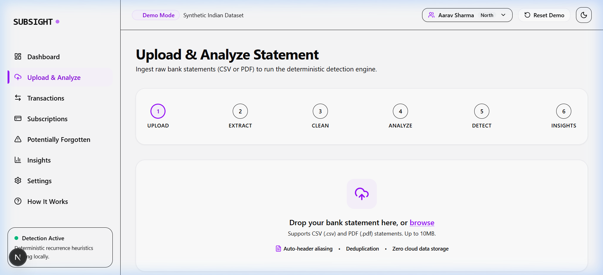
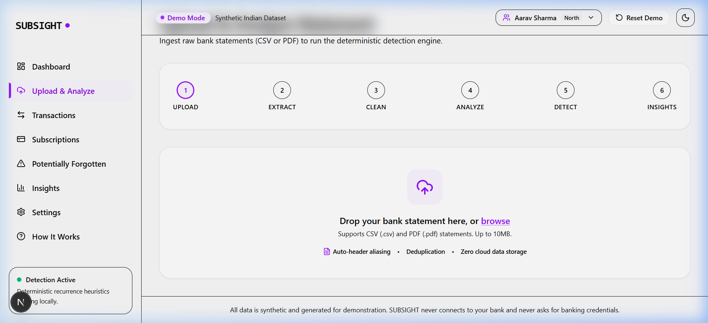
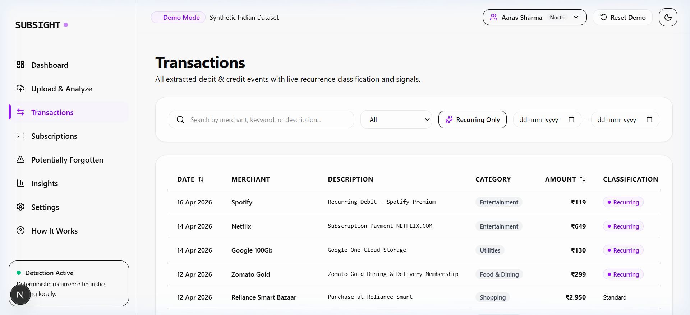
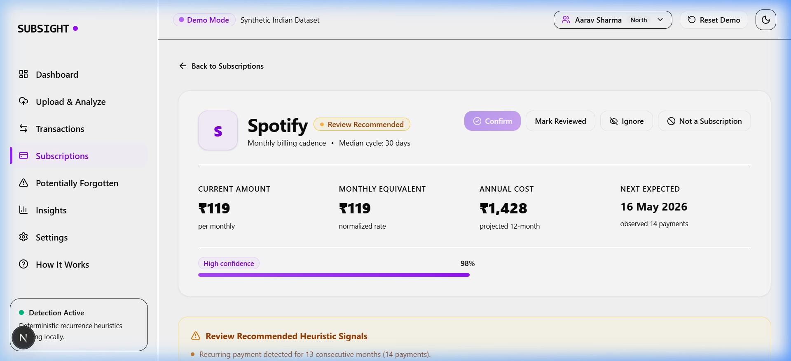
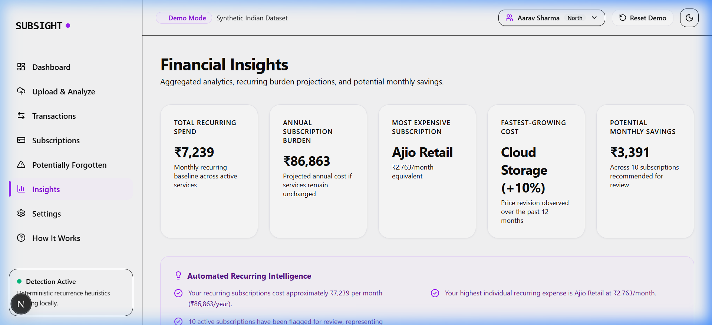
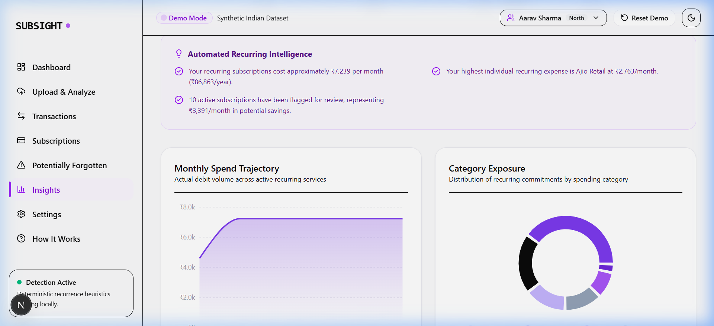
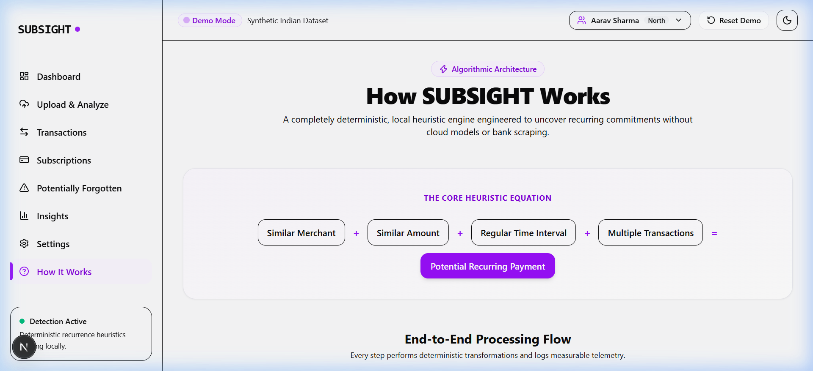
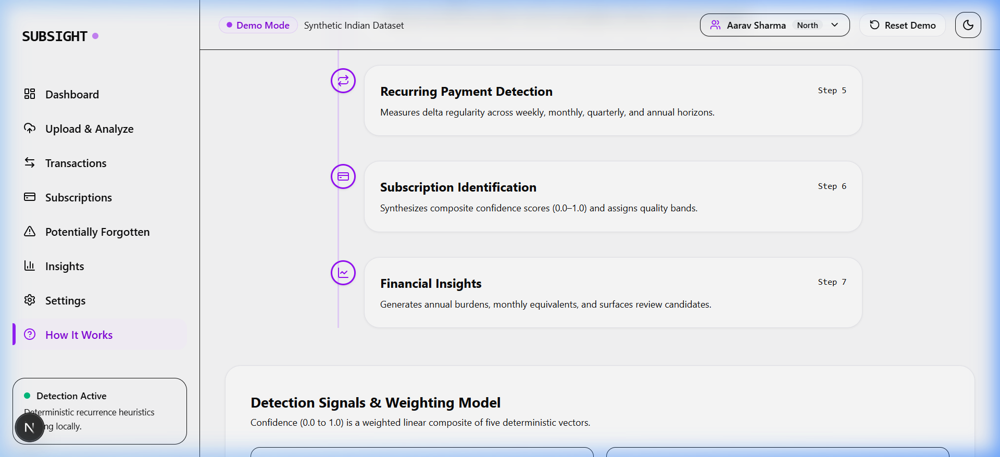
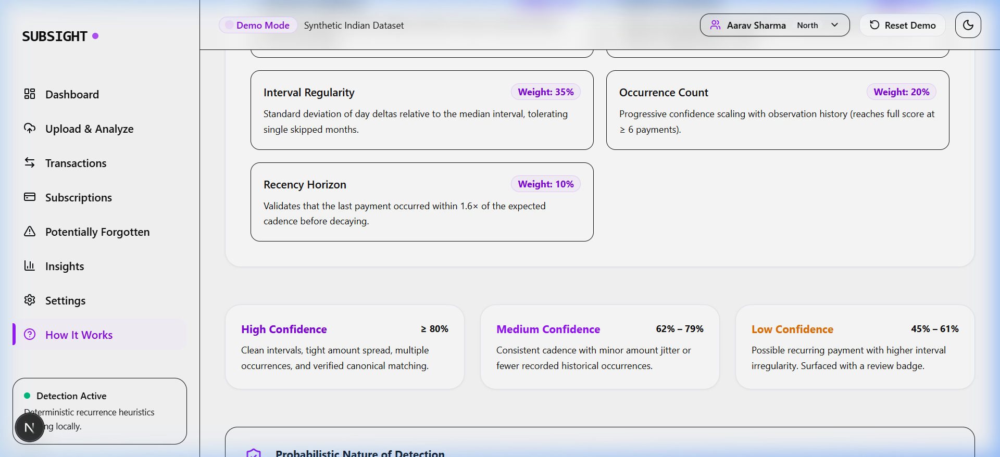

<div align="center">

# ⚡ SUBSIGHT
### Intelligent Subscription & Recurring Payment Detection Engine

*Ingest raw bank statements → clean messy merchant descriptors → detect recurring commitments → surface forgotten subscriptions → forecast your financial burden. Deterministic, privacy-first, 100% free to host.*

[](https://python.org)
[](https://fastapi.tiangolo.com)
[](https://nextjs.org)
[](https://tailwindcss.com)
[](https://postgresql.org)
[](LICENSE)

<br/>

### 🌐 [Live Demo → subsight-app.vercel.app](https://subsight-app.vercel.app) &nbsp;|&nbsp; ⚙️ [API Docs → Swagger UI](https://subsight-api-v2.onrender.com/docs)

<br/>


</div>

---

## 🔗 Live Production URLs

| Service | URL | Status |
|---------|-----|--------|
| 🌐 **Frontend (Vercel)** | [https://subsight-app.vercel.app](https://subsight-app.vercel.app) | ✅ Live |
| ⚙️ **Backend API (Render)** | [https://subsight-api-v2.onrender.com](https://subsight-api-v2.onrender.com) | ✅ Live |
| 📖 **Swagger / OpenAPI Docs** | [https://subsight-api-v2.onrender.com/docs](https://subsight-api-v2.onrender.com/docs) | ✅ Live |
| ❤️ **Health Check** | [https://subsight-api-v2.onrender.com/api/health](https://subsight-api-v2.onrender.com/api/health) | ✅ Live |
| 📦 **GitHub Source** | [https://github.com/alok-108/subsight](https://github.com/alok-108/subsight) | ✅ Public |

---

## 📸 Full Product Walkthrough

### 1. 📊 Interactive Analytics Dashboard
Real-time summary of monthly recurring spend, annual commitment, active subscriptions count, potential savings, and spend distribution charts — all pre-seeded with Indian demo data.

<p align="center">
  
</p>

---

### 2. 📤 Multi-Stage Statement Ingestion Pipeline
Upload CSV/PDF bank statements with instant row preview, automatic column mapping, and 7-stage engine execution with millisecond-level telemetry.

| File Upload & Column Mapping | 7-Stage Pipeline Telemetry |
| :---: | :---: |
|  |  |

---

### 3. 🧾 Transaction Ledger & Slide-over Drawer
Explore all normalized debit transactions with category filtering, date sorting, merchant grouping, and interactive drawer inspection.

| Filterable Transaction Ledger | Detailed Transaction Drawer |
| :---: | :---: |
|  |  |

---

### 4. 🔁 Subscriptions Explorer & Deep-Dive Inspection
View all detected recurring subscriptions with confidence badges (High / Medium / Low), cadence, amount, and full payment history.

<p align="center">
  
</p>

Deep-dive into any subscription with payment timelines, price-step revision alerts, and interval variance scatter plots:

| Subscription Metrics & Timeline | Interval Scatter Plot & Price Revision |
| :---: | :---: |
|  |  |

---

### 5. 👻 Potentially Forgotten Subscription Intelligence
Surfaces subscriptions needing review based on unconfirmed status, long tenure, and renewal proximity. Users can keep or cancel with instant state persistence.

| Review Banner & Surfaced Candidates | Interactive Keep / Cancel Actions |
| :---: | :---: |
|  |  |

---

### 6. 💡 Financial Burden Insights & Forecasting
Annual subscription commitments, highest recurring expenses, category-wise distribution, and upcoming renewal forecasts.

| Narrative Insights & Key Metrics | Yearly Spend Forecast & Comparison |
| :---: | :---: |
|  |  |

---

### 7. 🧠 Explainable AI & Algorithm Proof (`/how-it-works`)
Transparent mathematical explanation of the confidence scoring formula, interval analysis, amount clustering, and signal weighting — no black-box ML.

| Full Architecture Overview | End-to-End Pipeline Flow |
| :---: | :---: |
|  |  |

| Mathematical Confidence Formula | Signal Weighting Breakdown |
| :---: | :---: |
|  |  |

---

### 8. ⚙️ Settings & Dark Mode
Built-in dark mode, notification preferences, data retention controls, and 12 pre-seeded Indian demo user profiles.

| Settings & Data Erasure | Sleek Dark Mode Interface |
| :---: | :---: |
|  |  |

---

## 🧠 Algorithmic Detection Architecture

SUBSIGHT uses a **purely deterministic multi-stage pipeline** — no probabilistic LLM hallucinations, no brittle card scrapers:

```
┌─────────────────────┐    ┌──────────────────────────┐    ┌───────────────────────┐
│  Raw Statement Ingest│ →  │  Merchant Normalization   │ →  │  Amount Clustering    │
│  (CSV / PDF Parser) │    │  (Token cleanup, Aliasing)│    │  (Price Step Merging) │
└─────────────────────┘    └──────────────────────────┘    └───────────────────────┘
                                                                       │
                                                                       ▼
┌─────────────────────┐    ┌──────────────────────────┐    ┌───────────────────────┐
│  Forgotten Detection │ ←  │  Confidence Scoring      │ ←  │  Cadence Delta Engine │
│  (Neutral Heuristics)│   │  (0.00 → 1.00 Formula)   │    │  (Interval Variance)  │
└─────────────────────┘    └──────────────────────────┘    └───────────────────────┘
```

### Composite Confidence Formula

$$\text{Score} = 0.35 \times S_{\text{interval}} + 0.25 \times S_{\text{amount}} + 0.20 \times S_{\text{count}} + 0.10 \times S_{\text{merchant}} + 0.10 \times S_{\text{recency}}$$

| Band | Score Range | Meaning |
|------|-------------|---------|
| 🟢 **High** | ≥ 0.80 | Definite recurring subscription |
| 🟡 **Medium** | 0.62 – 0.79 | Probable subscription (e.g. variable cloud bill) |
| 🟠 **Low** | 0.45 – 0.61 | Possible pattern — user review recommended |
| ⚫ **Excluded** | < 0.45 | Not classified as recurring |

---

## 🚀 Quickstart (Local Development)

### Prerequisites
- Python 3.11+
- Node.js 20+
- PostgreSQL (or use SQLite for local dev)

### Option 1 — Auto Boot Scripts

```powershell
# Windows PowerShell
powershell -ExecutionPolicy Bypass -File scripts/dev.ps1
```

```bash
# macOS / Linux / WSL
./scripts/dev.sh
# or: make dev
```

### Option 2 — Manual Setup

```bash
# 1. Backend
cd backend
python -m venv venv
source venv/bin/activate        # Windows: .\venv\Scripts\activate
pip install -r requirements.txt
uvicorn app.main:app --host 127.0.0.1 --port 8000 --reload

# 2. Frontend (new terminal)
cd frontend
npm install
npm run dev
```

Open:
- **Frontend:** http://localhost:3000
- **API / Swagger:** http://localhost:8000/docs

---

## 🌐 Production Deployment (100% Free Tier)

| Component | Platform | Plan | Cost |
|-----------|----------|------|------|
| **Frontend** | Vercel | Hobby | ₹0/mo |
| **Backend API** | Render | Free Web Service | ₹0/mo |
| **Database** | Render | Free PostgreSQL | ₹0/mo |
| **Keep-Alive** | cron-job.org | Free | ₹0/mo |
| **Storage** | Cloudflare R2 | Free Tier | ₹0/mo |

Full deployment guide → [`DEPLOYMENT.md`](./DEPLOYMENT.md)

### 1-Click Deploy Backend to Render
[](https://render.com/deploy?repo=https://github.com/alok-108/subsight)

### 1-Click Deploy Frontend to Vercel
[](https://vercel.com/new/clone?repository-url=https://github.com/alok-108/subsight&root-directory=frontend&env=NEXT_PUBLIC_API_BASE_URL&project-name=subsight)

---

## 🧪 Testing

```bash
# Backend test suite
cd backend && pytest tests/ -v

# Frontend type check
cd frontend && npm run typecheck

# Full deployment verification
python scripts/verify_deployment.py --backend https://subsight-api-v2.onrender.com
```

---

## 🔒 Privacy Guarantee

- **Zero bank credentials required** — ingests exported statements only. No Plaid, no OAuth bank logins.
- **100% synthetic demo data** — pre-loaded with 12 diverse Indian profiles (Aarav, Priya, Arjun, Meera...) for safe, realistic testing.
- **Instant data purge** — one-click statement & transaction erasure from Settings.
- **No telemetry** — zero analytics, zero tracking, fully self-contained.

---

## 🗂️ Project Structure

```
subsight/
├── backend/                  # FastAPI Python backend
│   ├── app/
│   │   ├── main.py           # App entry point & router registration
│   │   ├── models/           # SQLAlchemy ORM models
│   │   ├── routers/          # API route handlers (dashboard, subscriptions, etc.)
│   │   ├── services/         # Detection engine, ingestion pipeline, insights
│   │   └── seed/             # Synthetic demo data (12 Indian user profiles)
│   ├── tests/                # Pytest test suite
│   └── requirements.txt
├── frontend/                 # Next.js 16 App Router frontend
│   ├── app/                  # Pages (dashboard, subscriptions, forgotten, etc.)
│   ├── components/           # Reusable UI components
│   ├── lib/                  # API client, types, utilities
│   └── next.config.ts
├── docs/
│   └── screenshots/          # 18 product screenshots
├── scripts/                  # Dev/deploy helper scripts
├── render.yaml               # Render Blueprint (backend + DB)
├── DEPLOYMENT.md             # Full deployment guide
└── README.md
```

---

## 📄 License

MIT License © 2024 — Built for hackathons, engineering demos, and personal-finance innovation.
